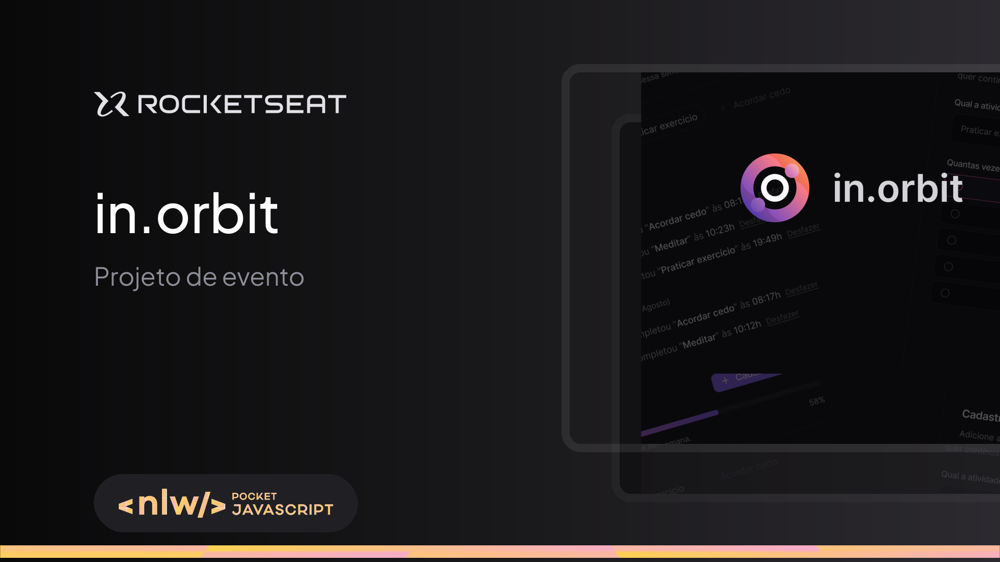

# NLW Pocket - in.orbit



Este foi um aplicativo desenvolvido durante a NLW (Next Leve Week) da Rocketseat, dos dias 8 a 11 de setembro.

O projeto é um site desktop de registro de metas com progresso semanal.

Para rodar o projeto, clone o repositório:
```bash
  git clone https://github.com/talles-morais/nlw-in.orbit-frontend.git
```
acesse a pasta do projeto e instale as dependências necessárias:
```bash
  npm install
  npm run dev
```